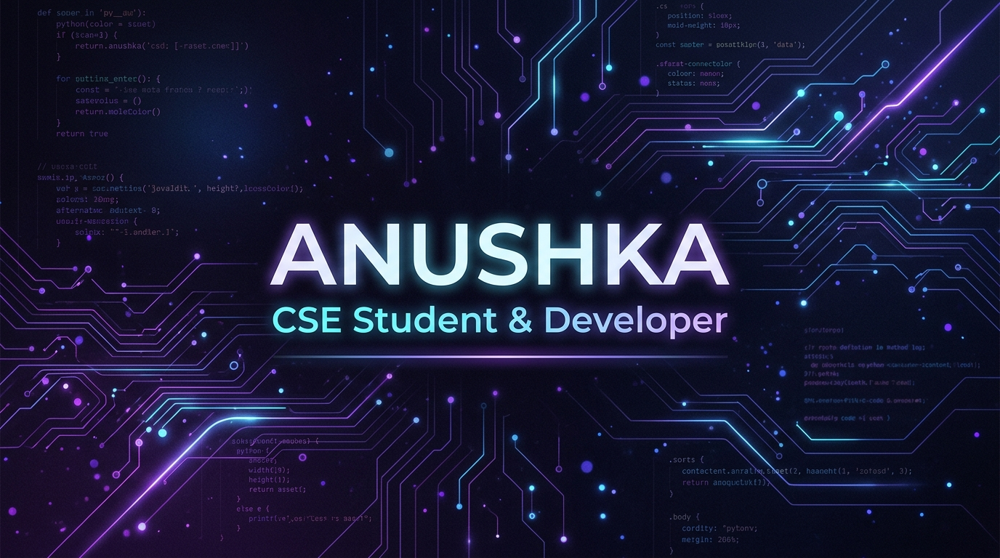

# Hello, World! I'm Anushka 

  

  

  
  
  

---

### 💫 About Me

I am a passionate **Computer Science & Engineering student** in my 3rd year. I love building clean, functional, and user-centric web applications and solving complex algorithmic challenges. 

- 🎓 **Education**: Pursuing B.Tech in Computer Science & Engineering
- 💻 **Fascinations**: Full-stack Development, Algorithm Design, AI Integrations, and Modern UX Design
- 🚀 **Goals**: Looking for software engineering internships and collaboration opportunities on open-source projects.
- ⚡ **Fun Fact**: I like visualizing how code works, which inspired me to build the Sorting Algorithm Visualizer!

---

### 🛠️ Tech Stack & Skills

<table width="100%">
  <tr>
    <td valign="top" width="50%">
      <h4>🌐 Frontend Development</h4>
      
      
      
      
    </td>
    <td valign="top" width="50%">
      <h4>⚙️ Backend & Databases</h4>
      
      
      
    </td>
  </tr>
  <tr>
    <td valign="top" width="50%">
      <h4>💻 Programming Languages</h4>
      
      
      
    </td>
    <td valign="top" width="50%">
      <h4>🛠️ Tools & Platforms</h4>
      
      
      
      
    </td>
  </tr>
</table>

---

### 🚀 Featured Projects

Here are some of the key projects I've built:

#### 📊 [Algo-Visualizer](https://github.com/anushka-2711/algo-visualizer)
> An interactive sorting algorithm visualizer built to demonstrate classic algorithms with real-time speed controls and custom array inputs.
- **Tech Stack**: HTML5, CSS3, JavaScript
- **Key Features**: Visualizes Bubble Sort, Selection Sort, Insertion Sort, Quick Sort, and Merge Sort. Interactive audio/visual feedback during sorting.

#### ✍️ [Inkwell -- AI-powered-blogging](https://github.com/anushka-2711/Inkwell--AI-powered-blogging)
> A modern AI-powered blogging platform designed to assist writers in generating ideas, structuring articles, and publishing content seamlessly.
- **Tech Stack**: React.js, Node.js, Express, AI API Integrations
- **Key Features**: Rich text editor, AI-assisted content writing, responsive dashboard, and tags organization.

---

### 🐍 My Contribution Snake

  <picture>
    <source media="(prefers-color-scheme: dark)" srcset="https://raw.githubusercontent.com/anushka-2711/anushka-2711/output/github-contribution-grid-snake-dark.svg" />
    <source media="(prefers-color-scheme: light)" srcset="https://raw.githubusercontent.com/anushka-2711/anushka-2711/output/github-contribution-grid-snake.svg" />
    
  </picture>

---

### 📊 GitHub & Coding Stats

  
  

  
  

---

  Let's connect and build something amazing together! 😊

